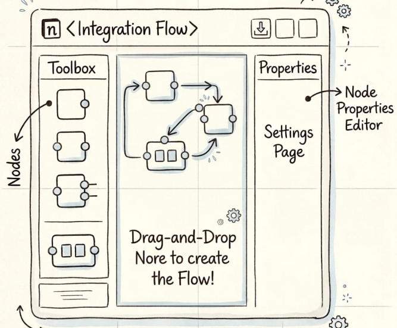

# Feature 2: Design Integration Flow

# Definiciones claves 

- **VETRO**: es un patron de integracion que permite ejecutar pasos para Validar, Enriquecer, Transformar, Enrutar y Operar sobre un mensaje (ejecutar operacion en core de negocio normalmente ejecutando un API).
- **Flujo de Integracion**: Es un conjunto de pasos (patron pipe & filter) que se ejecutan de forma secuencial para transformar y procesar mensajes exponiendo un API de tipo Restfull e integrando uno o varios servicios del core de negocio para satisfacer una necesita de procesamiento.
- **Pipe**: es una mecanismo que uno dos pasos del flujo para establecer una secuencia de transferencia de mensajes entre 2 filtros. 
- **Filter**: Es un proceso que ejecuta logica de  transformacion y/o procesamiento de mensajes.
- **API**: Es un mecanismo que permite exponer un flujo de integracion como un servicio restfull.
- **Message**: Es un conjunto de datos que se transmite entre los filtros del flujo de integracion.
- **Composicion del Flujo de Integracion**: Un flujo de integracion está compuesto por 3 subflujos: incoming flow, outgoing flow and exception flow.
    - **Incoming Flow**: es una secuencia de filtros que se ejecutan en un determinado orden secuencia cuando se recibe una peticion.
    - **Response Flow**: es una secuencia de filtros que se ejecutan en un determinado orden secuencia para entregar una respuesta.
    - **Exception Flow**: es una secuencia de filtros que se ejecutan en un determinado orden secuencia cuando se produce una excepcion en Incoming flow or response flow.

Nota: revisar el archivo @documentations\apiportal.drawio hoja "Data Model" para entender el modelo conceptual del flujo de integracion.

# Requirements

- Necesito gestionar un catalogo de flujos de integracion, teniendo un listado en formato card o tabla con cada flujo de integracion (id, nombre, descripcion, etiquetas para facilitar busquedas, estado) y un boton para editar o eliminar el flujo de integracion.
- Necesito poder crear un flujo de integracion, para lo cual necesito un diseñador de flujo de integracion que permita arrastrar y soltar filtros para crear un flujo de integracion.
- Se cuenta con un API Restful donde se mantiene el registro de toda la información que define los flujos de integraciones (https://api.prod.comsatel.com.pe/gatewayesb/gatewayesb/api-docs/Gateway%20Admin) pero no se mantiene un registro del diseño visual de los flujos de integracion.
- Las definiciones que los diferentes tipos de filtros y que propiedades contienen debemos registrarlos y mantenerlos en APIPortal

# Mockups

- Diseñador de Flujo de Integracion: 